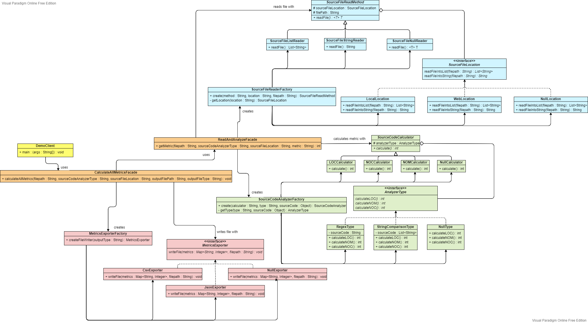

# Source Code Analyzer
The purpose of this project is to familiarize with design patterns.

## Patterns Used

### Strategy
Strategy is used in metrics exporters, since there is a set of different algorithms for creating the results file.
To be specific, <code>CsvExporter</code>, <code>JsonExporter</code> and <code>NullExporter</code> implement
<code>MetricsExporter</code> interface. In this way, it is quite easy to add a new exporting algorithm, as it only
requires adding a new class implementing the interface.

### Bridge
Bridge is used in source code analyzers and source file readers. 
In source code analyzers, two dimensions were noticed: the different metrics(loc, noc, nom) and the analyzer types(regex, strcomp).
So, with bridge it is easy to extend both dimensions by adding the corresponding classes. Also, adding
classes in one dimension does not affect the hierarchy of the other. The same pattern is applied in readers
with locations(local, web) and read methods(list, string) as dimensions. So the participating classes are: 
- <code>AnalyzerType</code>, <code>RegexType</code>, <code>StringComparisonType</code>, <code>NullType</code>
- <code>SourceCodeCalculator</code>, <code>LOCCalculator</code>, <code>NOCCalculator</code>, <code>NOMCalculator</code>, <code>NullCalculator</code>
- <code>SourceFileLocation</code>, <code>LocalLocation</code>, <code>WebLocation</code>, <code>NullLocation</code>
- <code>SourceFileReadMethod</code>, <code>SourceFileStringReader</code>, <code>SourceFileListReader</code>, <code>SourceFileNullReader</code>

### Null Object
It is possible that an unknown string can be passed in factories, so it is important that unknown object types are handled.
Also, it is easier to test them. Thus, <code>NullExporter</code>, <code>NullCalculator</code>, <code>NullType</code>, 
<code>NullLocaltion</code> and <code>SourceFileNullReader</code>
were created. Of course, they hide exceptions when calling them, so their behavior should be kept in mind when calling their methods.

### Factory
Factory is used in metrics exporters, source code analyzers and source file readers with
<code>MetricsExporterFactory</code>, <code>SourceCodeAnalyzerFactory</code> and <code>SourceFileReaderFactory</code>, since,
especially for analyzers and readers, object instantiation is complicating. So, it hides the
object instantiation from the client and provides an interface requiring some parameters. 
as strings.

### Facade
The first facade, <code>ReadAndAnalyzeFacade</code>, is made in order to hide complexity of readers and analyzers, while the second one, <code>CalculateAllMetricsFacade</code>,
uses the first one and additionally hides the writers' complexity. So, the client only calls the second facade with the least possible parameters,
without having to know the steps to use each class, similarly as with a library.  

### Class Diagram
It can also be found in the media directory. Colors represent different packages.

## Execution
1. Build the executable Java application with:
	mvn package jacoco:report

2. Run the executable by executing
   
		java –jar “jar-with-dependencies” arg0 arg1 arg2 arg3 arg4

	were args translate to: 	
	- arg0 = “JavaSourceCodeInputFile” (e.g., src/test/resources/TestClass.java)
	- arg1 = “sourceCodeAnalyzerType” [regex|strcomp]
	- arg2 = “SourceCodeLocationType” [local|web]
	- arg3 = “OutputFilePath” (e.g., ../output_metrics_file)
	- arg4 = “OutputFileType” [csv|json]
	
	example:
			
		java –jar ./target/sourcecodeanalyzer-0.0.1-SNAPSHOT-jar-with-dependencies.jar ./src/test/resources/TestClass.java regex local metrics_results csv